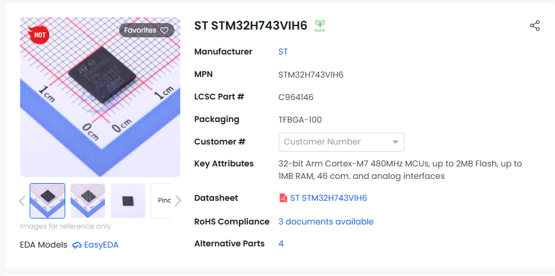

# 15th of August: Hardware selection and research

In terms of hardware, I made the following selections:

- STM32H743 for the main microcontroller as it is well documented within BetaFlight and INAV (the chosen flight control software).
It also has plenty of performance running at 480MHz and has a large variety of peripherals available which is useful for flight control.

- For flash memory for flight logs I initially chose the W25N02KVZEIR from winbond. However I think it is overkill for this and I will
instead use a micro SD card slot to keep cost and unnecessary complexity down.

- For sensors I went with the ICM-42688-P for the IMU as it is the preferred choice for BF hardware (which I am referencing), the BMP280
for pressure sensing as it again is preferred and is the standard in most off-the-shelf solutions. Finally, I went for the LIS3MDL for 
magnetic field sensing to produce a compass heading.

- For the power supply setup I decided on the AP2112K for the 3.3V rail as that is only going to pull at most 400mA while the AP2112K can
handle 600mA continuous. I decided to go for the AP1509-50SG-13 for the 5V rail as it can provide 2A which will be necessary for servos,
lights ETC when not using a BEC output from the ESC

**Total Time Spent: 2 hours**
