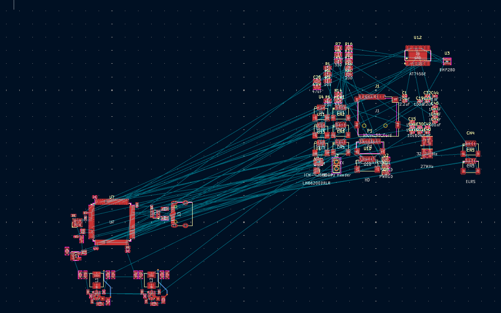
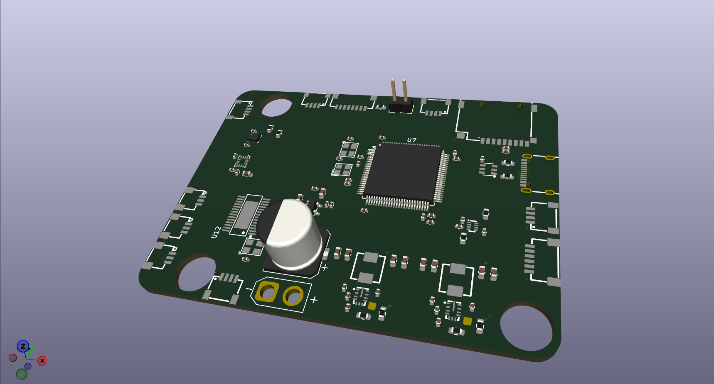

# 13th of August: Hardware selection and research

In terms of hardware, I made the following selections:

- STM32H743 for the main microcontroller as it is well documented within BetaFlight and INAV (the chosen flight control software).
It also has plenty of performance running at 480MHz and has a large variety of peripherals available which is useful for flight control.

- For flash memory for flight logs I initially chose the W25N02KVZEIR from winbond. However I think it is overkill for this and I will
instead use a micro SD card slot to keep cost and unnecessary complexity down.

- For sensors I went with the ICM-42688-P for the IMU as it is the preferred choice for BF hardware (which I am referencing), the BMP280
for pressure sensing as it again is preferred and is the standard in most off-the-shelf solutions. Finally, I went for the LIS3MDL for 
magnetic field sensing to produce a compass heading.

- For the power supply setup I decided on the AP2112K for the 3.3V rail as that is only going to pull at most 400mA while the AP2112K can
handle 600mA continuous. I decided to go for the AP1509-50SG-13 for the 5V rail as it can provide 2A which will be necessary for servos,
lights ETC when not using a BEC output from the ESC

**Total Time Spent: 2 hours**

# 14th of August: STM32 schematic setup

I spent some time drawing up the base schematic for the STM32H743 microcontroller setting up all the required components such as: 

- Power Input and decoupling
- 25mHz oscillator
- 32.768kHz oscillator for RTC
- SD card slot for black box logging in SDMMC 1 bit mode for simplicity
- BOOT0 connecter for entering DFU mode

Next I will add the peripherals and sort out UARTs as per betaflight's recommendation and then I will think about some extra features
that will make it stand out

**Total Time Spent: 2 hours**

# 14th of August: Planned out pin functions using cubeMX

I needed to plan out which pins I was going to use for the various UARTS and peripherals while making sure they did not clash. CubeMX files
will not be needed by INAV or BetaFlight but it is very useful in planning. I have not allocated misc pins such as beeper or lights as that
can be any GPIO pin

**Total Time Spent: 1 hour**

# 15th of August: Power setup and pin mapping

I mapped the pins in the schematic to their various functions including all the UARTS and I2C and SPI which I will wire up to the sensors
soon. I also added a USB C port with proper ESD protection and I added a 5V buck to convert the battery voltage into the 5V used by the 
peripherals and LDO for the MCU. I then added a 2 channel ideal diode to handle switching between USB 5V and the 5V coming from the battery
buck. Might have made some mistakes so will check through.

**Total Time Spent: 2 hours**

# 15th of August: Sensor Setup and 9V buck

I wired up the 3 sensors with SPI and I2C. I also added a 9V buck to step down VBAT to 9V for a HD VTX such as a DJI O3 or runcam wifilink.
I also corrected an error with my buck converter where feedback node was connected before inductor and not after.

**Total Time Spent: 1 hour**

# 30th of August: Sensor changes and OSD

Due to being extremely sensitive to interference, I have decided to remove the magnetometer and instead add the option to add one externally
and have also added the option for an airspeed sensor on the same I2C bus as the barometer. I have now added an analog OSD using the AT7456E
due to its price and availability as I wanted it to be analog friendly and added the corresponding JST connectors for the VTX and camera.

**Total Time Spent: 1.5 hours**

# 31st of August: Finalizing schematic and layout setup

I finalized the schematic and corrected some small errors here and there. I began the layout with the STM32H7 and it's various passives and
the oscillator. I then setup the 5V and 9V buck converters based on TI's reference layout guide making sure to be mindful of where different
power planes will be. I then planned the layout of the board and will soon move components into place and begin to route.

**Total Time Spent: 2 hours**

# 1st of September: PCB layout progress

I spent some time making progress on the PCB layout and planning the dimensions of the board. The form factor is a bit larger than most other 
fixed wing FC's but that is due to it being all on one board (power management, FC etc).

**Total Time Spent: 1 hour**

# 1st of September: Power layout

I finished laying out all the components and I added the inner ground plane and power rails for ease of layout. I made a ground moat around the 
highly sensitive sensors and fed them through a filtered 3.3V power to remove unwanted noise and provide a clean output.

