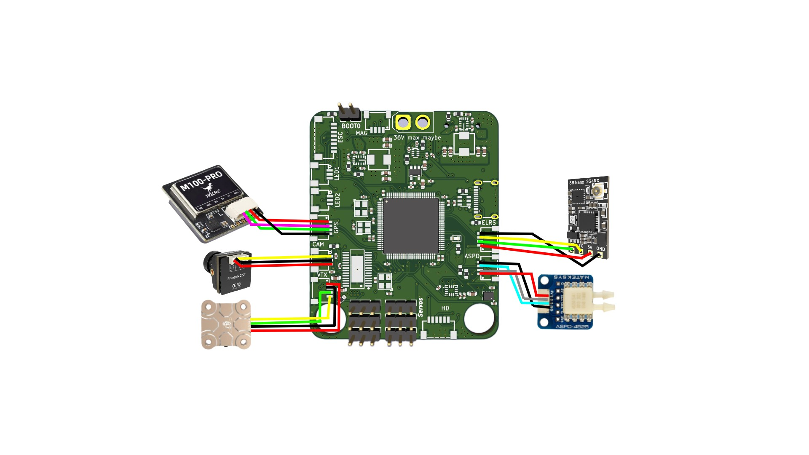

# SPAR

This is a flight controller primarily designed for fixed wing aircraft (or quadcopters etc) that is designed to 
run either BetaFlight, INAV or ArduPilot firmware. It handles flight stabilization, OSD, control of servos, waypoints,
data logging and anything else any other flight controller can do. This flight controller has an STM32H743 which is 
an extremely capable MCU with a blazing fast speed of up to 480MHz. Most likely overkill for the majority of applications
but it can accomodate for the most demanding projects. I made it as I was interested in the design of such systems
and also enjoy building aircraft and could find a highly capable flight controller useful plus the benefit that I have
built it myself.

**Specs:**

- ICM-42688-P for peak performance and high resolution positional sensing
- STM32H743 for processing whatever you need
- 5V and 9V buck converters for handling high power peripherals
- Micro SD card for black box logging
- 4 in 1 ESC support with DSHOT
- 6 other PWM outputs
- Analog OSD through AT7456E
- Support for external magnetometer, airspeed sensor and GPS
- BMP280 barometer for altitude measurements

**Peripherals:**

The flight controller board has connectors for external airspeed, GPS, and mag sensors as well as plugs for ELRS, 4 in 1 ESC, analog camera, analog VTX, digital VTX and PWM LEDs.

**Firmware/flashing:**

This board does not have custom firmware, it is based on INAV: https://github.com/iNavFlight/inav/.
However a custom build of INAV including relevant target configuration is required.
I will put this custom target in the /Project_Files/INAV folder. This tutorial shows how to build INAV with a custom target: https://youtu.be/ThrsS_y9zDo?si=cllAaaTRHZ6ADbW4
To flash the board, the board must be powered up with the boot0 pin shorted to enter DFU mode on the STM32 where it can then be flashed in INAV configurator.

**BOM:**

The board costs about £27 from JLCPCB for a basic 6 layer PCB. The BOM for components can be found in the BOM.csv in the production folder. This totals around £40 which mainly
accounts for buying large quantities of passives so the per board price is probably much cheaper.
