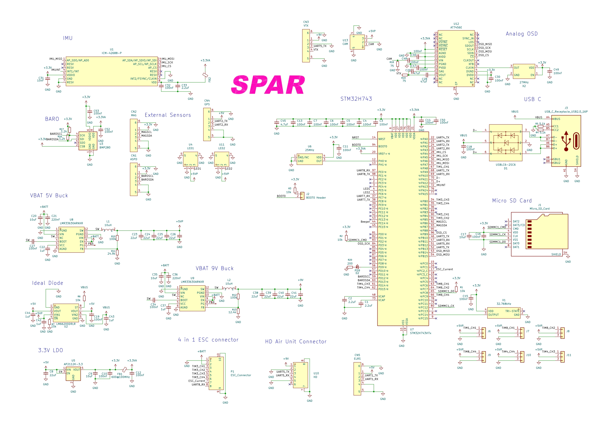

# SPAR

This is a flight controller primarily designed for fixed wing aircraft (or quadcopters etc) that is designed to 
run either BetaFlight, INAV or ArduPilot firmware. It handles flight stabilization, OSD, control of servos, waypoints,
data logging and anything else any other flight controller can do. This flight controller has an STM32H743 which is 
an extremely capable MCU with a blazing fast speed of up to 480MHz. Most likely overkill for the majority of applications
but it can accomodate for the most demanding projects. I made it as I was interested in the design of such systems
and also enjoy building aircraft and could find a highly capable flight controller useful plus the benefit that I have
built it myself.

Specs:

- ICM-42688-P for peak performance and high resolution positional sensing
- STM32H743 for processing whatever you need
- 5V and 9V buck converters for handling high power peripherals
- Micro SD card for black box logging
- 4 in 1 ESC support with DSHOT
- 6 other PWM outputs
- Analog OSD through AT7456E
- Support for external magnetometer, airspeed sensor and GPS
- BMP280 barometer for altitude measurements

BOM:

**Capacitors**

3× 0402 2.2uF

25× 0402 100nF

9× 0603 22uF

4× 0402 10uF

2× 0402 220nF

5× 0402 1uF

2× 0603 47uF

1× 0402 10nF

1× 0402 4.7uF

**Resistors**

5× 0603 10k

2× 0603 5.1k

2× 0603 100k

1× 0603 24.9k

1× 0603 12.4k

2× 0603 1.2k

2× 0603 75Ω

1× 0603 200Ω

**ICs / semiconductors**

1× ICM-42688-P

1× LM66200DRLR

1× BMP280

1× AP2112K-3.3

2× LMR33630ARNXR

1× STM32H743VITx

1× AT7456E

1× USBLC6-2SC6

**Inductors / ferrites**

2× 10uH (L5.2×W5.2)

2× 600Ω @ 100MHz ferrite bead, 0603

**Oscillators**

1× 25MHz SMD oscillator

1× 27MHz SMD oscillator

1× 32.768kHz SMD oscillator

**Connectors**

5× 1.0mm pitch 4-pin SMD connector

1× Micro SD card socket

1× 2-pin BOOT0 header

1× USB-C 16-pin receptacle

2× 1-pin connector

6× 2.54mm 3-pin headers

1× 2.54mm 8-pin ESC connector

1× 6-pin HD connector

2× 3-pin SMD connector

1× 3-pin SMD CAM connector

**LED**

1× 0603 LED (PD9)

**Rough total ~£45**
